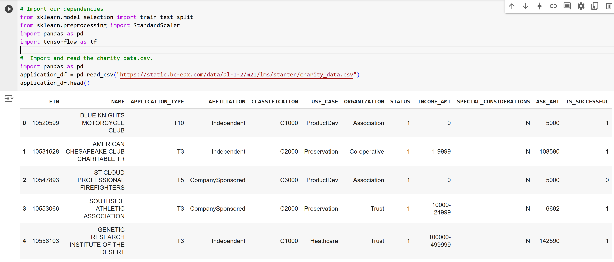
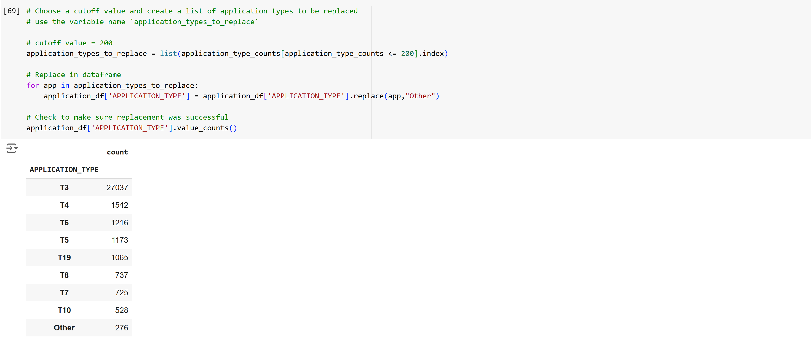
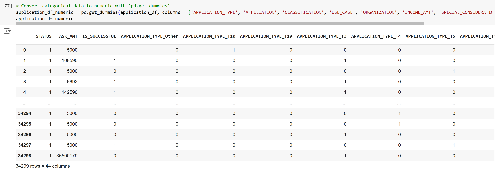
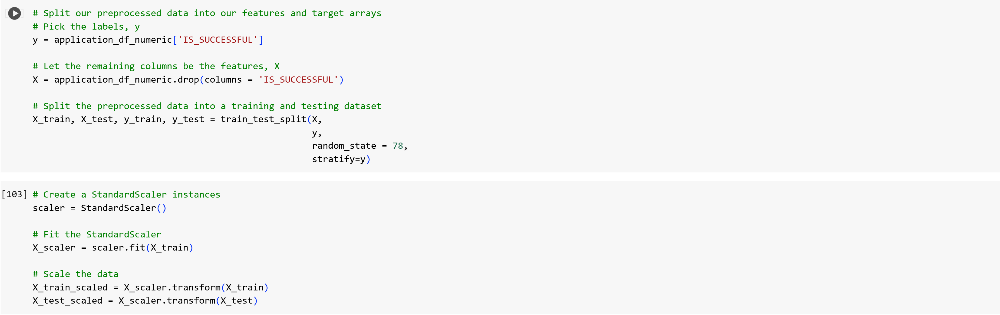
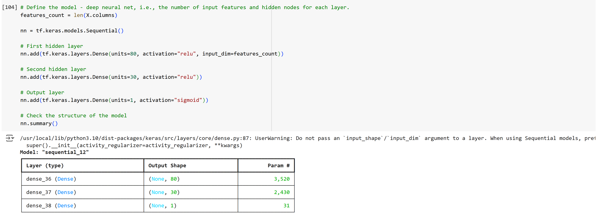
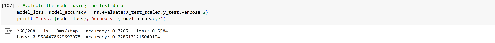
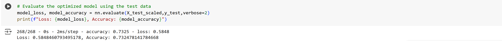

# Deep Learning Challenge
Data Visualization and Analytics Boot Camp Challenge 21

## Overview
Alphabet Soup is a nonprofit organization that provides funding to applicants for various ventures. The organization would like a tool that can help them predict an applicant's chance of success. This would of course be very useful since, with such a tool, Alphabet Soup would be able to make sure their limited funding is going to those ventures which will really benefit from it, and less money would be wasted.

In an attempt to provide such a tool, this project uses machine learning and neural networks to attempt to predict the outcome of a venture based on several criteria, including affiliation (independent or company-sponsored), organization (e.g. association, co-operative, or trust), and income. These criteria are the features (X) for the model, while the target (y) is the outcome (encoded in the 'IS_SUCCESSFUL' column of the imported DataFrame as 0 = unsuccessful and 1 = successul). 

## Results
We make two attempts to create a viable model. The initial model is produced in the Jupyter Notebook 'AlphabetSoupCharity.ipynb'. We begin by importing the necessary Python libraries (in particular sklearn and tensorflow, which we will use to create and run the neural network).

For our purposes, the columns serve the following purposes:
* 'IS_SUCCESSFUL' is the target variable (y). This is what we hope to be able to predict.
* 'APPLICATION_TYPE', 'AFFILIATION', 'CLASSIFICATION', 'USE_CASE', 'ORGANIZATION', 'STATUS', 'INCOME_AMT', 'SPECIAL_CONSIDERATIONS', 'ASK_AMT' are the features (X); these are the criteria by which we hope to predict the target.
* We have no use for the columns 'EIN' and 'NAME' since these are unique to each row; they're not helpful for making predictions because a new venture we want to evaluate will not match these.

As part of our preparation of the dataset, we group the least common application types under the banner 'Other'.

We perform an analogous step for the classification.

In order to set up the neural network, we must convert the categorial data (such as application type and classification) to numerical data. We do this using the Pandas function 'gut_dummies'.

Note that each categorical column is replaced by a set of columns with a 1 in each row that formerly had the appropriate value.

Now we are able to set up our target and features. We further split the data into training and test datasets for the neural network.

We then set up the neural network itself. In this initial attempt, we make the following choices:
* Two hidden layers between the input and output layers. We start with a low number in the hopes of maintaining relative computational ease.
* Into the two hidden layers, we insert 80 and 30 neurons, with 1 in the output layer. We similarly keep the number of neurons low here for efficiency purposes.
* For each hidden layer, the activation function is the very standard Rectified Linear Unit (ReLU). This function changes negative values to 0 and leaves positive values unchanged. It is a common default for hidden layers.
* For the output layer, the activiation function is the Sigmoid, which maps data to a range between 0 and 1. This is a common function for binary outputs, as we have here.

This initial attempt yields a somewhat disappointing accuracy of 0.7285. Our goal accuracy is 0.75.

Because of this failure in the initial model, we attempt several improvements in the Jupyter Notebook 'AlphabetSoupCharity_Optimization'. The attempted refinements are
* Splitting the 'Other' groups in the 'APPLICATION_TYPE' and 'CLASSIFICATION' columns into two and three separate groups, respectively. This should, in theory, give the model a more accurate picture of the dataset.
* Adding a third hidden layer between the input and output. In general, this should increase the accuracy because it allows the model to learn more complex patterns.
* Adding more nodes to each hidden layer (for totals of 120, 100 and 50). Again, this generally allows the model to learn more complex patterns.
* Changing the activation function in the hidden layers from ReLU to Tanh (the hyperbolic tangent function). This function is a less common function that maps data to a range between -1 and 1. Unlike the other three steps, this actually decreased the accuracy of the model, so it has been undone in the Jupyter Notebook.

Unfortunately, these changes only lead to a marginal improvement in accuracy. The result is 0.7325. This is better, but still below the goal of 0.75.

## Summary

Unfortunately, the two versions of the model fail to meet the goal accuracy, and I would therefore recommend that Alphabet Soup pursue a different model. Some things to consider are
* Adding even more hiddne layers and nodes. There is a tradeoff with computational cost, but it might be possible to achieve the desired accuracy before the network becomes too complex to be practical.
* Increasing or decreasing the number of iterations (epochs). Both versions of the model use 100. It might be the case that letting the model run longer will improve the accuracy. However, this is not always the case; it is worth noting that neither model seems to follow a linear trajectory in its accuracy at each step. That is, the model is not consistently improving its accuracy with each iteration. It may well be that adding epochs will not help with accuracy; on the other hand, for analogous reasons, decreasing the number of epochs might achieve the goal of 0.75. Again, however, there is no clear point at which the accuracy seems to peak and the consistently fall, so it's uncertain whether this would really happen. Furthermore, since the model does not exceed 0.75 accuracy at any individual step, changing the number of epochs will not hit the goal without other steps (such as changing the number of layers or nodes).